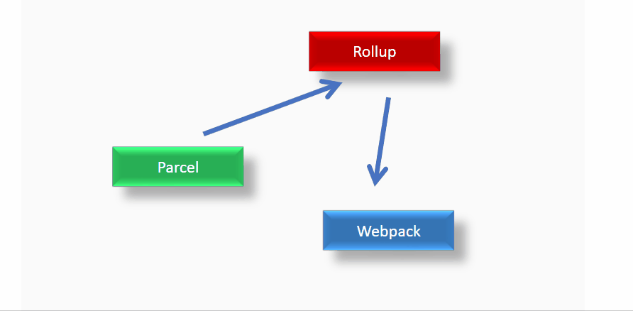
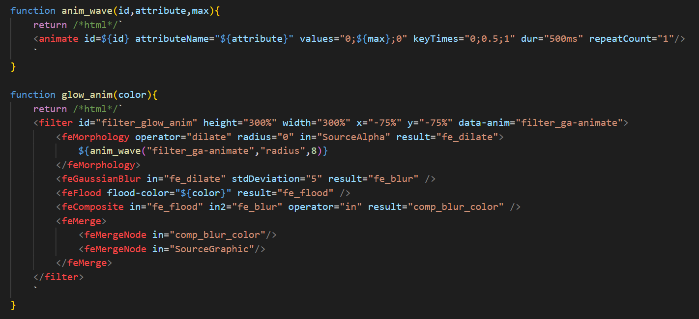

# deep-svg
Vanilla javascript and Web Component wrapper, using no dependencies for an svg pan zoom and deep linking. Interactions for making every text clickable and highlatable.
[Deep Linking](https://en.wikipedia.org/wiki/Deep_linking) allows links winthin html pages, why not generalise this to the text inside svg and without having to edit the svg ?
Each tspan is enriched with a click event, and the highlight function uses an animated svg filter.

# Live Demo
https://networkgraphs.github.io/deep-svg/

# Gif Demo


# Usage
## as a web component
Note that `html()` is a 3 line helper function and `/*html*/` helps lint the html text with the 'es6-string-html' plugin
```javascript
import "../src/index.js";

const src = "/demo/diagram.svg"
const deep = html(document.body,/*html*/`<deep-svg id="id1" src=${src} enable="true" />`);
deep.addEventListener('text_click',onTextClick);
deep.highlightText("Rollup");
```

## as a vanilla javascript module
```javascript
import * as svgm from "../src/js_comp.js";

let svg = await svgm.createElement(document.body,{src:"/demo/diagram.svg",id:"diagram_a",enable:true});
svg.addEventListener('text_click',onTextClick);
svgm.highlightText(svg,"Rollup");
```

# SVG Filter Animation
The highlight is animated through a morphology filter to create a smooth effect. The `dialate` operator radius is animated before the Gaussian blur is applied to it.

`Caution : This is vanilla javascript`. Note that the function `anim_wave()` is a generic function that can be placed in any section and starts animating the passed attribute patemeter.



## References
* https://developer.mozilla.org/en-US/docs/Web/SVG/Element/animate
* https://www.w3.org/TR/SVG/animate.html
